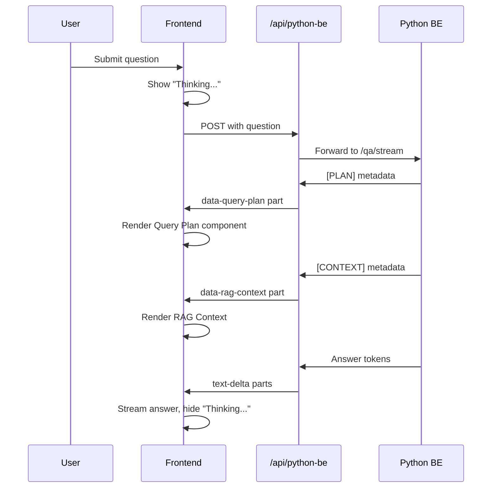
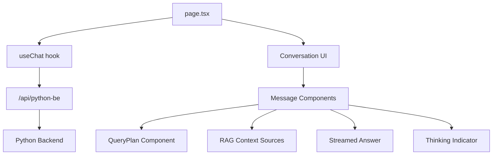

# IKMS Frontend - Intelligent Knowledge Management System

Next.js 16 RAGchat interface with real-time streaming and AI-powered query planning visualization.
Uploaded and Indexed PDF file is [here](https://github.com/inam95/ikms-fe/blob/main/data/pinecone_vector_database.pdf)

## 🎨 Feature: Query Plan Visualization

This frontend provides a modern chat interface that visualizes the AI's planning and reasoning process in real-time.

### What Users See

When asking a question, users experience a transparent, multi-stage response:

1. **🤔 "Thinking..." Indicator**
   - Appears immediately after submitting a question
   - Remains visible while the backend processes the query
   - Disappears when the first answer token arrives

2. **💡 Query Plan (Collapsible)**
   - Shows the AI's search strategy in natural language
   - Displays decomposed sub-questions
   - Expandable/collapsible to manage screen space
   - Example:
     ```
     Query Plan (3 sub-questions)
     ├─ Strategy: "This question requires information about
     │   multiple algorithms. Breaking into specific searches..."
     └─ Sub-queries:
        • Locality-sensitive hashing LSH algorithm
        • HNSW hierarchical navigable small world
        • Product quantization PQ compression
     ```

3. **📄 RAG Context (Collapsible)**
   - Shows retrieved document chunks from Pinecone
   - Provides transparency into information sources
   - Helps users verify answer accuracy

4. **💬 Final Answer**
   - Streams token-by-token in real-time
   - Verified and polished by the backend's verification agent
   - Clear, structured formatting

### Visual Flow



## 🏗 Architecture

### The Bridge Pattern: `/api/python-be/route.ts`

This Next.js API route acts as a **protocol translator** between the Python backend and the frontend's AI SDK.

**Why it exists:**

The AI SDK's `useChat` hook expects responses in the **UI Message Stream Protocol** format (typed message parts like `text`, `data`, `reasoning`). Our Python backend uses a simpler SSE format with text markers like `[PLAN]`, `[CONTEXT]`.

**What it does:**

```typescript
Python Backend          API Route              Frontend (useChat)
─────────────────      ───────────────        ──────────────────
[PLAN]{"..."}     →    data-query-plan    →   QueryPlan component
[REASONING]text   →    reasoning parts    →   Reasoning component
[CONTEXT]chunks   →    data-rag-context   →   Sources component
token             →    text-delta         →   MessageResponse
[DONE]            →    stream end         →   status: "ready"
```

**Key transformations:**

1. Extracts user question from UIMessage[] format
2. Calls Python backend's `/qa/stream` endpoint
3. Parses special markers (`[PLAN]`, `[REASONING]`, `[CONTEXT]`)
4. Converts to UI Message Stream Protocol parts
5. Returns properly typed stream for `useChat`

### Component Architecture



## 📦 Key Components

### `page.tsx` - Main Chat Interface

**Features:**

- `useChat` hook for state management and streaming
- Message part sorting (Plan → Reasoning → Context → Answer)
- "Thinking..." loading indicator logic
- Automatic scroll-to-bottom during streaming

**Message Part Ordering:**

```typescript
const order = {
  "data-query-plan": 0,  // Plan first
  reasoning: 1,           // Reasoning second
  "data-rag-context": 2,  // Context third
  text: 3                 // Answer last
};
```

### `query-plan.tsx` - Query Plan Visualization

Displays the AI's planning strategy using `ai-elements` components:

- Collapsible panel with plan description
- Sub-question list with expand/collapse
- Visual indicators (icons for strategy and search)
- Streaming state support (shows loading animation)

**Props:**

```typescript
{
  plan: string;              // Natural language strategy
  subQuestions: string[];    // Array of sub-queries
  isStreaming?: boolean;     // Show loading state
}
```

## 🛠 Tech Stack

- **Next.js 16** - React framework with App Router
- **AI SDK v6** (`ai`, `@ai-sdk/react`) - Chat streaming and state management
- **ai-elements** - Pre-built UI components for AI interfaces
  - Conversation, Message, MessageContent
  - Reasoning (collapsible thinking display)
  - Sources (collapsible context display)
  - Plan, Task (query plan visualization)
- **Radix UI** - Headless UI primitives (Collapsible, Dialog)
- **Tailwind CSS v4** - Utility-first styling
- **Lucide React** - Icon system
- **Motion** - Animation library

## 🏃 Local Setup

### Prerequisites

- **Node.js 18+** ([download](https://nodejs.org/))
- **pnpm** package manager ([installation guide](https://pnpm.io/installation))

### Installation

1. **Clone the repository**

   ```bash
   git clone <repository-url>
   cd ikms-fe
   ```

2. **Install dependencies**

   ```bash
   pnpm install
   ```

3. **Create `.env.local` file (optional)**

   By default, the frontend connects to `http://localhost:8001`. To override:

   ```bash
   cp .env.example .env.local
   ```

   Edit `.env.local`:

   ```env
   PYTHON_BE_URL=http://localhost:8001
   ```

4. **Start the development server**

   ```bash
   pnpm dev
   ```

5. **Open in browser**

   Navigate to `http://localhost:3000`

### Building for Production

```bash
# Build optimized production bundle
pnpm build

# Start production server
pnpm start
```

## 📁 Project Structure

```
ikms-fe/
├── src/
│   ├── app/
│   │   ├── page.tsx               # Main chat interface
│   │   ├── layout.tsx             # Root layout with providers
│   │   ├── globals.css            # Global styles
│   │   └── api/
│   │       └── python-be/
│   │           └── route.ts       # Backend bridge API route
│   ├── components/
│   │   ├── query-plan.tsx         # Query plan visualization
│   │   └── ai-elements/           # ai-elements UI components
│   │       ├── conversation.tsx
│   │       ├── message.tsx
│   │       ├── reasoning.tsx
│   │       ├── sources.tsx
│   │       ├── plan.tsx
│   │       └── ...
│   └── lib/
│       └── utils.ts               # Utility functions
├── public/                        # Static assets
├── .env.example                   # Environment variable template
├── package.json                   # Dependencies and scripts
└── README.md                      # This file
```

## 🎨 UI/UX Highlights

### Thinking Indicator Logic

Shows a loading indicator at the right moment:

```typescript
// Show "Thinking..." when:
// 1. Question just submitted (status === "submitted")
// 2. OR streaming but no text content yet (only metadata)
const shouldShowThinking =
  status === "submitted" ||
  (status === "streaming" &&
   lastMessage?.role === "assistant" &&
   !hasTextContent);
```

This ensures users see immediate feedback while the backend processes their question, even if metadata (plan, context) arrives before the answer.

### Message Part Sorting

Messages can receive parts in any order due to async streaming. The UI automatically sorts them for consistent display:

```typescript
// Sort parts to always show in logical order
message.parts.sort((a, b) => {
  const orderA = order[a.type] ?? 999;
  const orderB = order[b.type] ?? 999;
  return orderA - orderB;
});
```

### Collapsible Sections

All metadata (Query Plan, RAG Context) is collapsible by default, keeping the UI clean while remaining accessible when needed.

## 🔧 Configuration

### Environment Variables

| Variable        | Required | Default                 | Description     |
| --------------- | -------- | ----------------------- | --------------- |
| `PYTHON_BE_URL` | No       | `http://localhost:8001` | Backend API URL |

### Customization Points

**Styling:** All components use Tailwind CSS. Customize theme in `tailwind.config.ts`.

**Message Ordering:** Modify the `order` object in `page.tsx` to change display sequence.

**Streaming Behavior:** Adjust `useChat` configuration in `page.tsx` for different streaming patterns.

## 🚀 Development Scripts

```bash
# Start development server with hot reload
pnpm dev

# Build for production
pnpm build

# Start production server
pnpm start

# Run linter
pnpm lint

# Fix linting issues automatically
pnpm lint:fix

# Check TypeScript types
pnpm check-types

# Format code with Prettier
pnpm format:write
```

## 🎯 Key Implementation Details

### UI Message Stream Protocol

The AI SDK expects a specific SSE format:

```typescript
// Message part structure
type MessagePart =
  | { type: "text"; text: string }
  | { type: "reasoning"; text: string }
  | { type: "data-query-plan"; data: {...} }
  | { type: "data-rag-context"; data: {...} };
```

The `/api/python-be` route ensures all parts conform to this structure.

### Streaming State Machine

The `useChat` hook provides status updates:

- `ready` - Ready for new input
- `submitted` - Question sent, awaiting response
- `streaming` - Receiving stream data
- `error` - Error occurred

The UI reacts to these states to show appropriate indicators.

## 📝 Adding New Message Part Types

To add a new custom part type:

1. **Backend**: Add a new marker in `ikms-be/src/app/api.py`

   ```python
   yield f"data: [NEWTYPE]{data}\n\n"
   ```

2. **API Route**: Handle in `/api/python-be/route.ts`

   ```typescript
   if (trimmedData.startsWith("[NEWTYPE]")) {
     writer.write({
       type: "data-new-type",
       id: nanoid(),
       data: parseData(trimmedData.slice(8))
     });
   }
   ```

3. **Frontend**: Render in `page.tsx`

   ```typescript
   case "data-new-type":
     return <YourComponent key={...} data={part.data} />;
   ```

4. **Ordering**: Add to sort order
   ```typescript
   const order = {
     "data-query-plan": 0,
     "data-new-type": 1,    // Your new type
     // ...
   };
   ```
